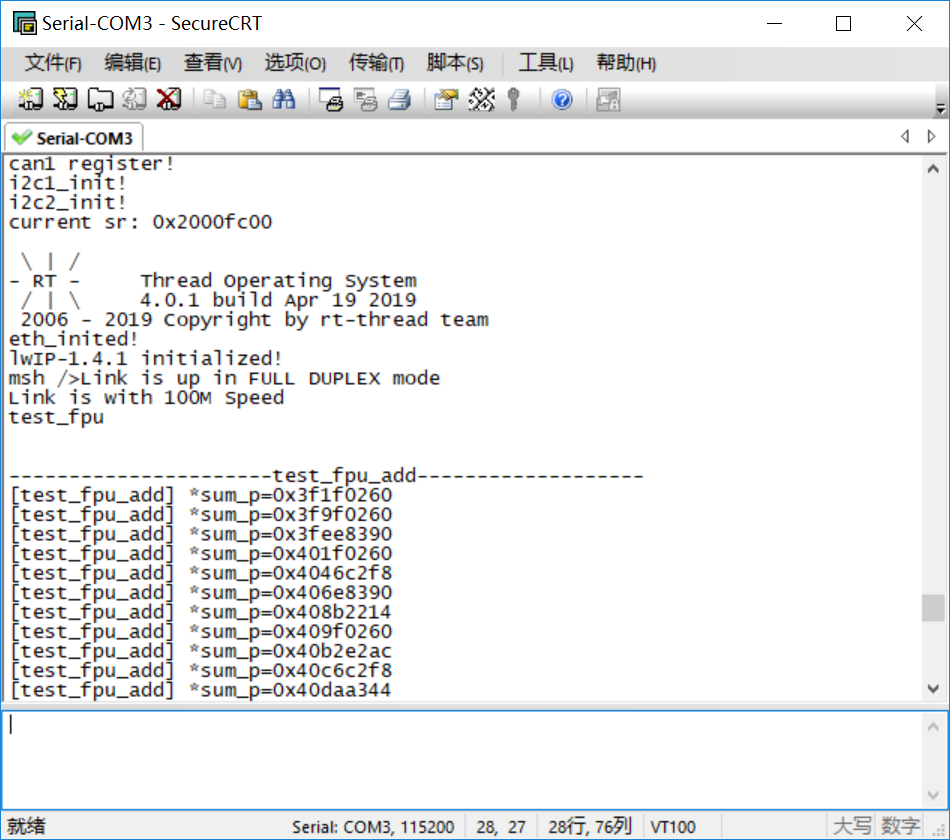
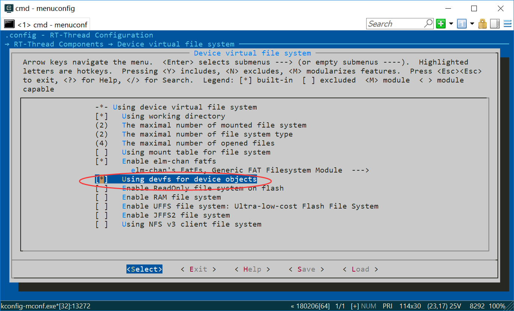
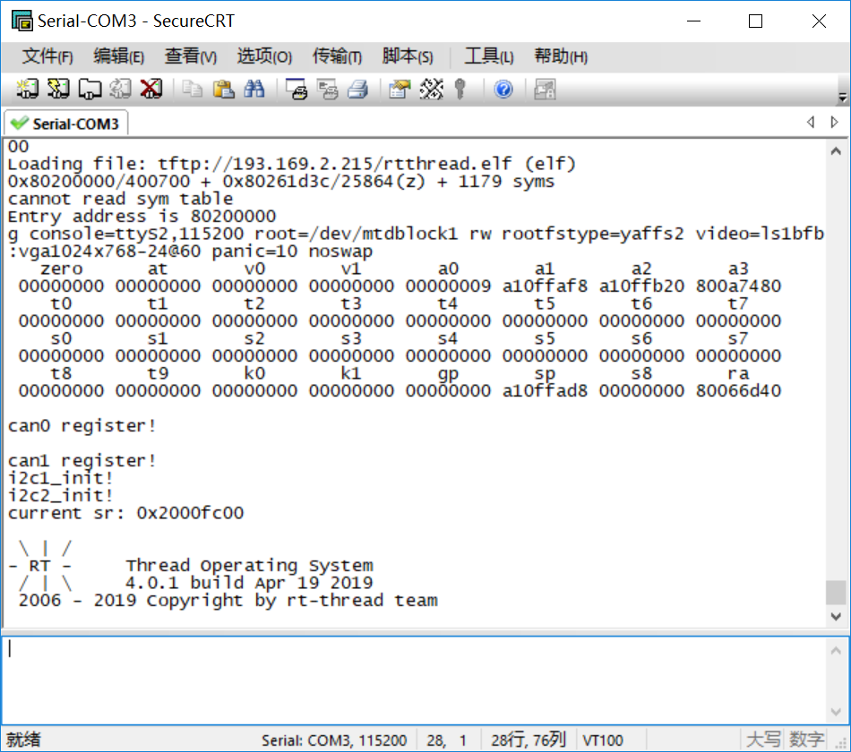
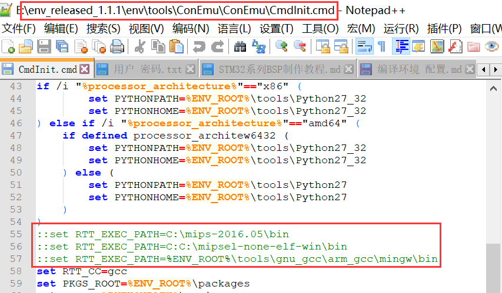
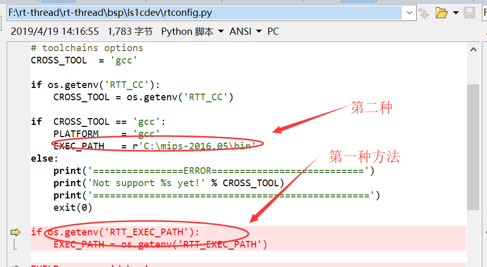
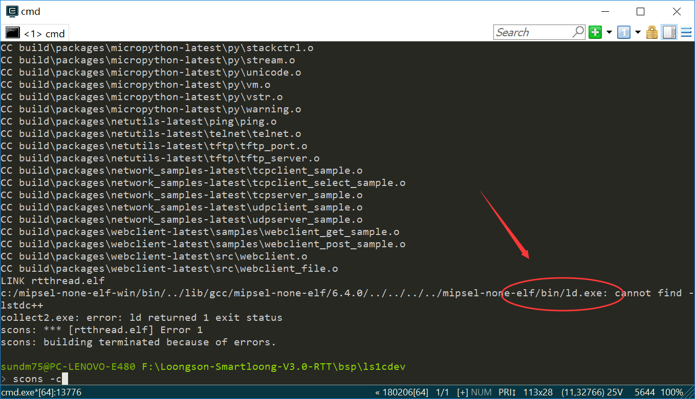
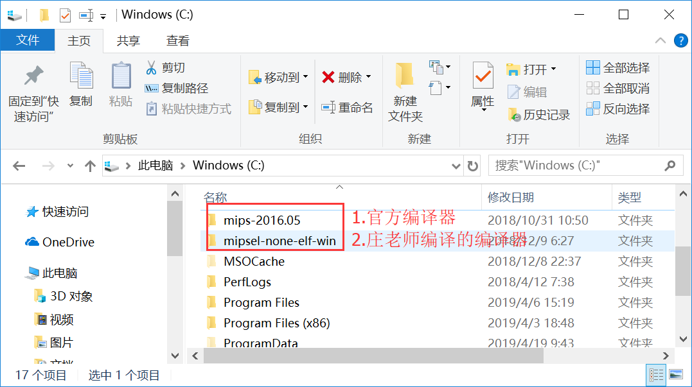

# 龙芯1C编译器的总结

## 问题的提出：
- 1.在使用浮点时究竟是硬浮点还是软浮点？
- 2.官方编译器与庄老师的编译器针对的工程的区别？

## 1. 关于硬浮点测试

 [勤为本关于 在龙芯1C上移植硬浮点FPU到RT-Thread](https://blog.csdn.net/caogos/article/details/7733489)
在RTT 的主线bsp中已经进行了相关的移植。
将勤为本 在github上的例程 test_fpu.c 放到 application 文件夹下，test_fpu.c 源码为：
```
// 硬浮点测试用例的源文件

#include <rtthread.h>
#include <stdlib.h>  
#include "../libraries/ls1c_public.h"


// 每个测试用例中for循环的最大值
#define TEST_FPU_MAX_COUNT          (1000)


// 使用硬浮点执行浮点数的加法
void test_fpu_add(void)
{
    unsigned int i = 0;
    float sum_f = 0.0;
    unsigned int *sum_p = (unsigned int *)&sum_f;

    rt_kprintf("\n\n----------------------%s-------------------\n", __FUNCTION__);
    for (i=0; i<TEST_FPU_MAX_COUNT; i++)
    {
        sum_f += 0.62113;
        rt_kprintf("[%s] *sum_p=0x%x\n", __FUNCTION__, *sum_p);
    }

    return ;
}


// 使用硬浮点执行浮点数的减法
void test_fpu_subtraction(void)
{
    unsigned int i = 0;
    float result_f = 252.731;
    unsigned int *result_p = (unsigned int *)&result_f;

    rt_kprintf("\n\n----------------------%s-------------------\n", __FUNCTION__);
    for (i=0; i<TEST_FPU_MAX_COUNT; i++)
    {
        result_f -= 0.62113;
        rt_kprintf("[%s] *result_p=0x%x\n", __FUNCTION__, *result_p);
    }

    return ;
}


// 使用硬浮点执行浮点数的乘法
void test_fpu_multiplication(void)
{
    unsigned int i = 0;
    float result_f = 9.016;
    unsigned int *result_p = (unsigned int *)&result_f;

    rt_kprintf("\n\n----------------------%s-------------------\n", __FUNCTION__);
    for (i=1; i<TEST_FPU_MAX_COUNT; i++)
    {
        result_f *= 1.00001;
        rt_kprintf("[%s] *result_p=0x%x\n", __FUNCTION__, *result_p);
    }

    return ;
}


// 使用硬浮点执行浮点数的除法
void test_fpu_division(void)
{
    unsigned int i = 0;
    float result_f = 723.801;
    unsigned int *result_p = (unsigned int *)&result_f;

    rt_kprintf("\n\n----------------------%s-------------------\n", __FUNCTION__);
    for (i=1; i<TEST_FPU_MAX_COUNT; i++)
    {
        result_f /= 1.00003;
        rt_kprintf("[%s] *result_p=0x%x\n", __FUNCTION__, *result_p);
    }

    return ;
}


// 测试使用硬浮点进行浮点数的加减乘除
void test_fpu(void)
{
    // 使用硬浮点执行浮点数的加法
    test_fpu_add();

    // 使用硬浮点执行浮点数的减法
    test_fpu_subtraction();

    // 使用硬浮点执行浮点数的乘法
    test_fpu_multiplication();

    // 使用硬浮点执行浮点数的除法
    test_fpu_division();

    return ;
}

#include  <finsh.h> 
FINSH_FUNCTION_EXPORT(test_fpu, test_fpu  e.g.test_fpu());
/* 导出到 msh 命令列表中 */
MSH_CMD_EXPORT(test_fpu, test_fpu);
```
## 2.硬浮点的编译参数
bsp 目录下有个SConstruct文件，中有一段代码：
```
if GetDepend('RT_USING_FPU'):
    env['CCFLAGS']   = env['CCFLAGS'].replace('-msoft-float', '-mhard-float')
    env['ASFLAGS']   = env['ASFLAGS'].replace('-msoft-float', '-mhard-float')
    env['CXXFLAGS']  = env['CXXFLAGS'].replace('-msoft-float', '-mhard-float')
    env['LINKFLAGS'] = env['LINKFLAGS'].replace('-msoft-float', '-mhard-float')
```
说明了如果定义 RT_USING_FPU 时，采用mhard 即 件方式 编译浮点。
在 msh 中进行测试，测试如果如图1所示。



## 3 开启DevFS后卡死
DevFS 即设备文件系统，在 RT-Thread 操作系统中开启该功能后，可以将系统中的设备在 /dev 文件夹下虚拟成文件，使得设备可以按照文件的操作方式使用 read、write 等接口进行操作。
如图2开启devfs . 

存盘、编译（编译器：mips-2016.05）后下载运行出现图3错误，程序停止运行。


## 4. 更换编译器运行

mipsel-none-elf-win编译器为厦门大学庄老师提供。

rtconfig.py文件中:
```
EXEC_PATH   = r'C:\mipsel-none-elf-win\bin'
...
PREFIX = 'mipsel-none-elf-'
```
下载后 test_fpu 运行正常。

## 5. EXEC_PATH说明

在 rtconfig.h 中， EXEC_PATH指明了编译的路径。 该路径可以从2个地方进行加载。

- \env_released_1.1.1\env\tools\ConEmu\ConEmu\ConEmu.init 文件的第55行。


- rtconfig.py文件中定义。


为了方便修改，这里将 ConEmu.init 中的ECEUpath 注释。后面都从 rtconfig.py 中加载。

## 6. 已经调试成功能编译柿饼环境配置

柿饼用C++, 必须在 .config 配置中打开 RT_USING_CPLUSPLUS 
```
# toolchains options
CROSS_TOOL  = 'g++'
```
这就产生了问题 ， 普通工程 mipsel-none-elf- 编译 C++(打开 RT_USING_CPLUSPLUS ) 用 gcc 和 g++ 链接是不成功的，如图所示。



官方 mips-sde-elf-  编译硬浮点后使用 devfs 会卡死。如3.中描述。

**以上都用常用工程（rtgui demo 和 tesp_fpu）及 柿饼工程（必须用C++ 链接）分别进行测试。**

## 7. 结论

- 1.为了方便修改，不要在 Cmdinit.cmd （5.中描述）中修改 RTT_EXEC_PATH 路径。直接在 rtconfig.py 修改。使用了2个宏定义来进行选择。
```
# 使用硬浮点必须在 .config 中定义 RT_USING_DFP;
# 普通工程(不用C++)用  mipsel-none-elf- 可用 软浮点 + devfs ;可用 硬浮点 + devfs; 只可用 gcc 链接 ;不可定义 RT_USING_CPLUSPLUS ; 显示gui demo 不可用RT_USING_DFP
PLATFORM_SEL = 'cc' 

# 柿饼工程(用C++)用  mips-sde-elf- 可用 软浮点 + devfs ; 不可用硬浮点+ devfs (如果用了就卡死); 只能用 g++ 链接;
PLATFORM_SEL = 'c++' 
```
- 2.如果要使用使用硬浮点必须在 .config 中定义 RT_USING_DFP; 这时候推荐使用  mipsel-none-elf-  即 ```PLATFORM_SEL = 'cc'```. 官方的 mips-sde-elf- 可以使用，不过一旦加上了 devfs ，则一定会卡死。
- 3.如果要编译柿饼工程，一定要用 C++ ,则一定要用官方的编译器，即 ```PLATFORM_SEL = 'c++' ``` 。
- 4.常规缺省工程用 **官方编译器、C++、软浮点**。即：
```
PLATFORM_SEL = 'c++'
RT_USING_CPLUSPLUS [=y]
RT_USING_FPU [=n]
```
- 5.如果要编写网络相关工程（如at-device）,则一定要使用mipsel-none-elf-，即：
```
PLATFORM_SEL = 'cc'
RT_USING_CPLUSPLUS [=n]
RT_USING_FPU [=y]
```
- 6.经过以上设置后，用户在不同的编译中切换，仅要修改的3个地方：
  - 1)将2个编译器复制到 C 盘根目录下。如图示。
    
  - 2)rtconfig.py 中选择宏定义 **PLATFORM_SEL**。
  - 3)在 menuconfig 中配置 RT_USING_CPLUSPLUS 和 RT_USING_DFP。


